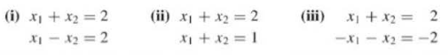
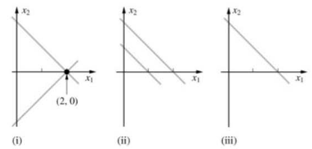

# Sistema de Equações Lineares

Uma equação linear em variáveis $x_{1}...x_{n}$ é uma equação que pode ser escrito da seguinte da forma:
$$
a_{1}x_{1}+a_{2}x_{2}+...+a_{n}x_{n}=b
$$
onde *b* e os coeficientes $a_{1}...a_{2}$ são números reais ou complexos. 

Equações lineares que não parecem equações a primeira vista:
$$
\begin{align*} 
4x_{1}-5x_{2}+2&=x_{1} &x_{2}=2(\sqrt{6}-x_{1})+x_{3} 
\end{align*}
$$
Elas podem ser reorganizadas :
$$
\begin{align*} 
3x_{1}-5x_{2}&=-2 & 2x_{1}+x_{2}-x_{3}=2\sqrt{6} 
\end{align*}
$$
Um sistema de equações lineares ou sistema linear é uma coleção de uma ou mais equações lineares envolvendo as mesmas variáveis.
$$
\begin{align}
x_1-2x_2&=-1\\
-x_1+3x_2&=3
\end{align}
$$
Solução de uma sistema é uma lista($S_1...S_{n}$) de números que fazem cada equação verdadeira ao substituir esses valores em $x_{1}...x_{n}$.

>  Um sistema linear pode possuir:
>
> 1. Uma solução. (interceptam em um ponto)
> 2. Infinitas soluções. 
> 3. Nenhuma solução. (linhas sem encontro)

Um sistema linear é consistente se houve solução, caso contrário é inconsistente.

O conjunto de todas as possíveis soluções é o conjunto solução. Dois sistemas lineares são ditos equivalentes se possuem o mesmo conjunto solução. Isso quer dizer: cada solução do primeiro sistema é solução do segundo sistema e vice-versa.

As duas linhas em (i) se interceptam no ponto (2,0). Portanto, {(2,0)} é o conjunto solução de (i). No sistema (ii) é inconsistente e seu conjunto solução é vazio. As duas equações no sistema (iii) representa a mesma linha.

# Notação de Matriz

