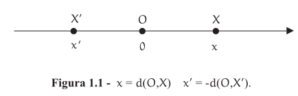
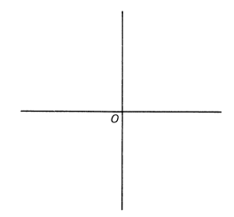
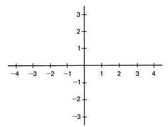
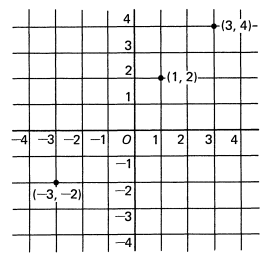

# Coordenadas

Dados dois pontos A e B, o comprimento do segmento de reta AB chama-se a distância entre os pontos A e B. Denotamos isso por d(A,B) ou $\overline{AB}$ para indicar essa distância, que é um número real.

> É muito comum representar d(A,B) como $\mid AB \mid$.

Essa noção permite atribuir coordenadas aos pontos de uma reta, ou seja, cada ponto da reta é representado por um número real.

> Um número real x representando um ponto X da reta é chamado de coordenada desse ponto. Cada ponto é representado por um único número e cada número possui um único ponto.

Para isso, precisamos escolher um ponto da reta para representar a origem, o ponto O, esse ponto corresponde ao número zero. Devemos depois, orientar para qual sentido da reta será atribuído valores positivos e negativos.

Podemos determinar que um ponto a direita de O é representado por número positivo x, sendo x, a distância desse ponto até a origem. Enquanto isso, um ponto a esquerda de O é representado por um número negativo x', sendo o valor absoluto de x, a distância desse ponto até a origem.

## Pontos no plano

A ideia se expande ao considerar um plano, onde duas retas se cruzam em um ponto O chamado de Origem.

Essas linhas serão chamadas de eixos. Agora selecionamos uma unidade de comprimento e cortamos os eixos.

Esse plano pode ser considerado um mapa para pontos, basta fornecer as coordenadas para encontra-los.

Na figura acima temos um ponto (3,4), outro ponto (1,2). Até mesmo coordenadas de valores negativos para o ponto (-3,-2).

   

  