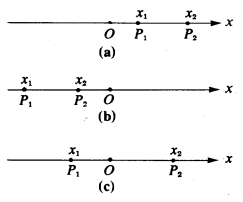
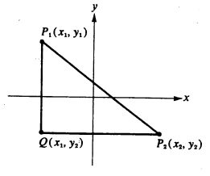
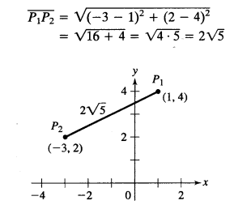
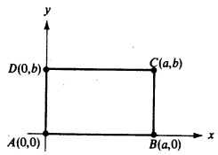
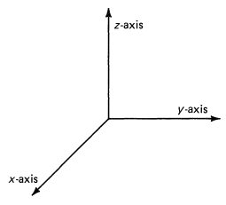
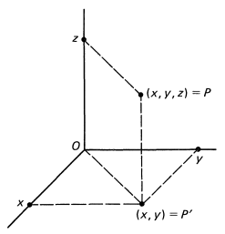

# Distância Entre Pontos

Seja $P_1$ e $P_2$ dois pontos numa reta coordenada e que $x_1$ e $x_2$ sejam, respectivamente, suas coordenadas.

Se $P_1$ e $P_2$ estão a direita da origem(situação **a**), com $P_2$ mais a direita, temos:
$$
\overline{P_1P_2}=\overline{OP_2}-\overline{OP_1}=x_2-x_1
$$

> $\overline{P_1P_2}$ é a distância entre $P_2$ e $P_1$
>
> $\overline{OP_2}$ é a distância entre $P_2$ e a Origem.
>
> $\overline{OP_1}$ é a distância entre $P_1$ e a Origem.

Se $P_1$ e $P_2$ estão a esquerda da origem(situação **b**), com $P_2$ mais a direita, temos:  
$$
\overline{P_1P_2}=\overline{OP_1}-\overline{OP_2}=-x_1-(-x_2)
$$
Ou seja:
$$
\overline{P_1P_2}=\overline{OP_1}-\overline{OP_2}=x_2-x_1
$$

> 1. Os números reais $x_1 $ e $x_2$ são negativos por estarem à esquerda da origem. 
>
> 2. Precisamos ter muito cuidado na aplicação, pois como estamos lidando com distâncias, ela não pode ser negativa. Por isso deve ser feito (maior distância) - (menor distância).
>
> 3. No comentário sobre a situação **b**, a distância $\overline{OP_1}$ é maior que a distância $\overline{OP_2}$, por isso devemos fazer $\overline{OP_1}-\overline{OP_2}$ , (como ambos estão a esquerda da origem, suas coordenadas devem ser negativas), ou seja, $-x_1-(-x_2)$, por fim, $x_2-x_1$.

Se $P_1$ está à esquerda e $P_2$ está à direita da origem(situação **c**), com $P_2$ mais distante da origem, temos:

$$
\overline{P_1P_2}=\overline{OP_1}+\overline{OP_2}=x_2-x_1
$$
A expressão acima pode ser compreendida ainda como (maior distância - menor distância).

Como uma distância não pode ser negativa, muitas vezes é mais conveniente representar uma d(PQ) como $\mid x-y\mid$ ao considerar x e y como coordenadas, respectivamente, dos pontos P e Q.

Então, seguindo essa ideia, podemos representar as situações a,b,c descritas antes como :

​	a.$\overline{P_1P_2}=\mid x_2-x_1\mid$

​	b. $\overline{P_1P_2}= \mid x_2-x_1 \mid$

​	c. $\overline{P_1P_2}= \mid x_2-x_1 \mid$

Isso simplifica o processo quando não temos conhecimento dos valores das coordenadas dos pontos.

# Distância entre pontos no plano( $\R^2$)

Vamos supor que $P_1$ e $P_2$ sejam dois pontos representados no plano, sendo que $P_1=(x_1,y_1)$ e $P_2=(x_2,y_2)$. Uma linha vertical atravessando por $P_1$ é desenhada e intercepta a linha horizontal, que passa por $P_2$, o encontro dessas duas linhas é o ponto $Q = (x_1,y_2)$.

De acordo com o que foi discutido antes:
$$
\begin{align}
\overline{QP_2} &= \mid x_2-x_1\mid \\ 
\overline{P_1Q}&= \mid y_2-y_1\mid
\end{align}
$$

> Estamos considerando valores absolutos para a distância, é mais conveniente. Não é preciso ter preferencia entre quais valores subtrair $\mid x_2-x_1 \mid$ e $\mid x_1-x_2 \mid$ resultam no mesmo resultado, o mesmo se aplica para os demais casos.

$P_1P_2Q$ formam um triângulo retângulo(o ângulo reto está presente em $Q$). Devido a esse fato, podemos usar o Teorema de Pitágoras para encontrar o comprimento(distância) de $\overline{P_1P_2}$ .

> Considerando :
>
> $\overline{QP_2}$ e $\overline{P_1Q}$ como catetos e $\overline{P_1P_2}$ como hipotenusa.

$$
\begin{align} 
\overline{P_1P_2} = \sqrt{\mid x_2-x_1\mid^2 +\mid y_2-y_1\mid^2 }
\end{align}
$$

> Veja que $\mid x_2-x_1\mid^2$ é igual a $(x_2-x_1)^2$ e a $(x_1-x_2)^2$.
>
> Podemos comparar no exemplo ao considerar $x_2=2$ e $x_1=3$:
>
> Temos $\mid 2-3|²=1$, da mesma forma, $(2-3)^2=1$ e também $(3-2)^2=1$. 

A equação geral para encontrar a distância entre dois pontos no plano:
$$
\begin{align} 
\overline{P_1P_2} = \sqrt{(x_2-x_1)^2 +(y_2-y_1)^2 }
\end{align}
$$

## Exemplo 1

Encontre a distância entre $P_1=(1,4)$ e $P_2=(-3,2)$.

## Exemplo 2

Prove que as diagonais de um retângulo são iguais.

$$
\begin{align}
\overline{AC}&=\sqrt{(a-0)^2+(b-0)^2}=\sqrt{a²+b^2}\\
\overline{BD}&=\sqrt{(0-a)^2+(b-0)^2}=\sqrt{a²+b^2}\\

\end{align}
$$
Já que $\overline{AC}=\overline{BD}$, o teorema está provado.

# Distância entre pontos no plano( $\R^3$)

Representação do plano tridimensional:

Dado um ponto $P=(x,y,z)$, vamos tentar determinar a distância desse ponto até a origem, que possui a coordenada (0,0,0).

Podemos ver que $d(O,P')$ :
$$
(\overline{OP'})^2= x²+y²
$$

> Para chegar a essa conclusão, basta usar Teorema de Pitágoras.

Mas $d(O,P)$:
$$
(\overline{OP})^2=(\overline{OP'})^2+z^2
$$
Ou seja:
$$
(\overline{OP})^2=x^2+y^2+z^2
$$
Mas isso é uma equação para calcular de $P=(x,y,z)$ até $O=(0,0,0)$. A equação geral seria, considerando a distância entre dois pontos, $P =(x_1,y_1,z_1)$ e $Q=(x_2,y_2,z_2)$:
$$
(\overline{PQ})^2=(x_2-x_1)^2+(y_2-y_1)^2+(z_2-z_1)^2
$$

$$
\overline{PQ}=\sqrt{(x_2-x_1)^2+(y_2-y_1)^2+(z_2-z_1)^2}
$$

