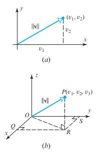

# Norma

Norma é uma sinônimo para comprimento de um vetor **v** , o simbolo $\mid\mid v \mid\mid $ é usado para indicar o módulo( magnitude / comprimento) do vetor.

Veja na imagem abaixo como é sugestivo aplicar Teorema de Pitágoras para descobrir a norma do vetor. Na situação (a), temos um vetor $(v_1,v_2)$ em  $\R^2$, sua norma é calculada usando:
$$
\mid \mid v\mid \mid = \sqrt{v_1^2+v_2^2}
$$
 Caso seja um vetor $(v_1,v_2,v_3)$ no espaço $\R^3$:
$$
\mid \mid v\mid \mid = \sqrt{v_1^2+v_2^2+v_3^2}
$$
  

Seguindo esse padrão, podemos tentar generalizar a formula pra encontrar a norma (comprimento, módulo, magnitude) de um vetor num espaço $\R^n$:
$$
\mid \mid v\mid \mid = \sqrt{v_1^2+v_2^2+...+v_n^2}
$$

> Ao multiplicar um vetor por um número k escalar, seu comprimento é multiplicado k vezes também.
>
> Se $v=(v_1,v_2,...,v_n)$, então $kv=(kv_1,kv_2,...,kv_n)$, então :
> $$
> \begin{align}
> \mid\mid kv\mid \mid &=	\sqrt{(kv_1)^2+(kv_2)^2+...+(kv_n)^2} \\
> &=\sqrt{(k)^2(v_1^2+v_2^2+...+v_n^2)}\\
> &=\mid k\mid *\sqrt{(v_1^2+v_2^2+...+v_n^2)}\\ 
> &=\mid k\mid *\mid \mid v \mid 	\mid\\ 
> 
> \end{align}
> $$

Propriedades da norma :

1. $\mid \mid v \mid \mid \geq 0$ , sendo que $\mid \mid v\mid \mid=0$ se e somente se o vetor **v** = 0.
2. $\mid \mid kv\mid \mid = \mid  k \mid\mid \mid v\mid \mid$

# Vetor unitário

O vetor de norma igual a 1 é chamado de vetor unitário.