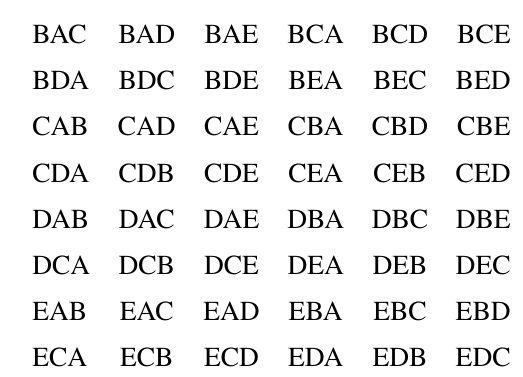
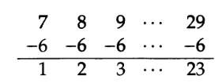
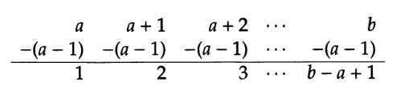

# Contagem 

# Introdução

## O que é combinatória ?

Combinatória é a matemática de contagem. Alguns problemas que são de interesse da combinatória :

1. Se você tem 5 livros e deseja colocar 3 em uma estante, de quantas maneiras isso pode ser feito ?
2. Se você tem n livros e deseja colocar k em uma estante, de quantas maneiras pode ser feito?
3. Quantas palavras de tamanho n podem ser construídas do alfabeto {a,b} tal que não haja nenhuma palavra com dois 'a' adjacentes ?
4. De quantas formas n casais compostos por duas pessoas , uma do sexo feminino e outra do sexo masculino, podem sentar em uma mesa circular 

Uma forma de resolver o exemplo 1 seria questionar se a ordem em que os 3 livros são colocados na instante é importante ou se deveríamos selecionar qual dos livros colocar. Se todos os livros são diferentes, podemos assumir para cada livro uma letra , o conjunto desses 5 livros pode ser representado como {A,B,C,D,E}. A lista de possibilidades será listada abaixo, respeitando a ordem das letras como a ordem da organização dos livros na estante.

Começando com o livro A:

$\begin{align}ABC && ABD && ABE && ACB && ACD && ACE \\ ADB && ADC && ADE && AEB  && AEC &&  AED\end{align}$

Combinações restantes:

Apesar dessa abordagem ser intuitiva e clara, fazer isso para valores cada vez maiores levaria um tempo absurdo. Se tiver de organizar 10 livros em 5 lugares de uma estante, haveria 30,000 possibilidades de se fazer, o que não é agradável por meio da força bruta (listar todas as combinações).

## Contagem é aritmética ( Capítulo alternativo)

### Lista de números

#### Problema 1

Quantos números há na lista abaixo ?

> 1, 2, 3, 4, 5, 6, 7, 8, 9, 10, 11, 12, 13, 14, 15, 16, 17, 18

Podemos claramente ver que há apenas 18 itens.

#### Problema 2

Quantos números há entre o número 7  e 29 (incluindo esses dois números) ?

> 7, 8, 9, 10, 11, 12, 13, 14, 15, 16, 17, 18, 19, 20, 21, 22, 23, 24, 25, 26, 27, 28, 29

Uma abordagem seria contar os números um por um e perceber que há 23 números. Outra abordagem inteligente seria tornar essa sequência igual a sequência do problema 1, que fornece automaticamente um significado claro que envolve tanto a sequência quanto sua quantidade de itens.

Podemos transformar essa lista subtraindo de cada item 6 unidades :

Então dessa nova lista tiramos a conclusão de que há 23 itens na lista original. Percebe-se que o mesmo se consegue fazendo $(29-7)+1$ 

Uma fórmula geral para achar a quantidade números entre a e b ( considerando-os também) , sendo que $b>a$ :

Então, a maior parte dos problemas pode ser resolvida ao converter o problema em problemas mais simples e que tenhamos noção.

#### Problema 3

Texto:

> Quantos múltiplos de 3 há entre 62 e 215 ?

Vemos que $\normalsize \frac{62}{3}=20 \frac{2}{3}$ , então o menor múltiplo de 3 em nossa lista é $3 \times 21 = 63$. De forma parecida , $\normalsize \frac{215}{3}=71 \frac{2}{3}$, então o maior múltiplo de 3 dentro da lista é $3 \times 71 = 213$. Então nossa lista de múltiplos é :

> 63, 66, 69 , ..., 213.

Podemos converter essa lista para uma que conhecemos como contar, podemos dividir cada item por 3:

> 21, 22, 23, ..., 71

E como vimos anteriormente , podemos tornar essa lista mais óbvia ao converter em outra. O que pode ser alcançado subtraindo 20 de cada item:

> 1, 2 , 3, ..., 51 

Então há 51 que são múltiplos de 3 na lista (de 62 a 215). 

Observação :

> O penúltimo e último são relativamente simples. Vamos analisar os múltiplos do número 2 :
>
> $2 \times {\color{red}1};2 \times {\color{red}2}; 2 \times {\color{red}3}; 2 \times {\color{red}4}...$
>
> Isso dá resultado para a seguinte lista de múltiplos :
>
> 2, 4, 6, 8...
>
> Veja que os números em vermelho formam uma sequência que indica a ordem em que os múltiplos aparecem, o número 2 é o $\color{red}1 º$ ( primeiro) múltiplo de 2 , e essa lógica pode ser aplicada para todos os itens dessa sequência. 

#### Problema 4

a) Quantos múltiplos há entre 9 e 101 ?

É fácil notar que a lista de possíveis múltiplos é 10,20,30,40,50,60,70,80,90,100 , ou seja, 10 múltiplos. Poderíamos inclusive dividir cada item por 10 para ordenar na ordem em que aparecem, teríamos  : 1,2,3,4,5,6,7,8,9,10.

b) Quantos múltiplos há entre 11 e 103 ?

A lista de múltiplos agora vai de 20,...,100  , logo são apenas 9 múltiplos. Caso dividir cada item por 10 para ordenar conforme surge , temos : 2, ..., 10 . Nesse caso ainda temos 9 itens.  Poderíamos ainda tornar essa sequência mais natural ao subtrair 1 de cada termo , o que resulta em : 1, ..., 9.

#### Problema 5

Texto:

> Quantos números de 4 dígitos são cubos perfeitos (ex : 27 é um cubo perfeito,pois $3^3=27$.)

Obviamente testar número por número é uma opção inviável. O que podemos fazer é encontrar o menor e o maior número da nossa lista, talvez até encontrar uma forma mais conveniente de contar todos os números entre eles depois disso.

O menor número de 4 dígitos, que é um cubo perfeito, é $1000=10^3$.

O maior número talvez seja um pouquinho mais complicado. Isso exige fazer testes, podemos usar o método de tentativa e erros. Temos a noçao de que $20^3=8000$, então vamos tentar com números depois de 20:

> $21^3=9261 \\ 22^3=10648$

Veja que o número 22 ao cubo ultrapassa o limite da nossa lista, pois resulta em número de 5 dígitos. Nesse caso, o $21^3 = 9261$ é o maior número da nossa lista que contém apenas números de 4 dígitos. Então, nossa lista é :

>  $1000,...,9261$ 

Podemos escrever essa mesma lista assim :

> $10^3,11^3,12^3,...,20^3,21^3$

Claramente podemos notar que a quantidade de números é igual a quantidade números da lista abaixo:

> $10,11,12,...,20,21$

Logo, há 12 números na lista, o que é nossa resposta.

### Contando com adição e subtração

#### Problema 1 

> ​	Numa escola há 12 jogadores em um time de futebol. Todos os jogadores precisam frequentar pelo menos um aula de língua estrangeira. A escola oferece apenas espanhol ou francês como língua estrangeira. 8 dos jogadores assistem aulas de Espanhol e 5 frequentam ambas as aulas de língua. Quantos jogadores fazem Francês.

Os jogadores que frequentam as aulas de Francês podem ser classificados em **duas categorias**: Aqueles que também frequentam aulas de Espanhol, e aqueles que não enfrequentam as aulas de Espanhol. 

Como dito no texto, **o número de jogadores que frequentam tanto Espanhol quanto Francês é 5.**

Agora precisamos encontrar o número de jogadores que não fazem Espanhol, mas fazem Francês. Veja que há 12 jogadores no time ao todo, sendo que 8 deles fazem Espanhol, então os que não fazem Espanhol é $12-8=4$ . Como cada jogador do time precisa frequentar pelo menos uma aula de idioma estrangeiro, **logo, esses 4 só podem ser os que fazem Francês**.

Então, o total de jogadores que fazem Francês é a soma dessas duas categorias $5+4 = 9$. Nove são os que fazem Francês.

  