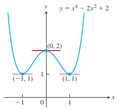

# Exercícios de Derivadas

# Exercício 1

> A curva $y=x^4 - 2x^2+2$ possui alguma linha tangente horizontal ?

## Solução 

A linha horizontal ocorre quando a inclinição $\large\frac{dy}{dx}$ é zero :
$$
\frac{dy}{dx}=\frac{d}{dx}(x^4-2x^2 + 2)=4x^3 -4x
$$
Agora resolvendo usando $\large  \frac{dy}{dx}$$=0$ :
$$
4x^3-4x=0 \\
4x(x^2-1) = 0 \\
x = 0,1,-1
$$
 Então a curva possui tangentes horizontais  em $x=0,1,-1$ :

# Exercício 2

> Ache a derivada de $y=(x^2+1)(x^3+3)$.

## Solução

Isso pode ser resolvido de duas formas.

A primeira forma consiste em considerar a equação como um produto de duas funções :
$$
y = (x^2+1)(x^3+3) = (u)(v)
$$
A derivada do produto de duas funções se dá pela regra do produto :
$$
\frac{d}{dx}(uv) = u \frac{dv}{dx}+v \frac{du}{dx}
$$
Aplicando na nossa equação :
$$
\frac{d}{dx}[(x^2+1)(x^3+3)] = (x^2+1)(3x^2)+(2x)(x^3+3)\\
5x^4+3x^2+6x
$$
​	

A segunda forma se trata de fazer o produto da expressão original antes de derivar :
$$
y = (x^2+1)(x^3+3) = x ^5+x^3+3x^2+3\\
$$
Para aplicar a derivada nessa expressão não será necessário o uso da regra do produto :
$$
\frac{d}{dx}(x^5+x^3+3x^2+3) =5x^4+3x^2+6x
$$
