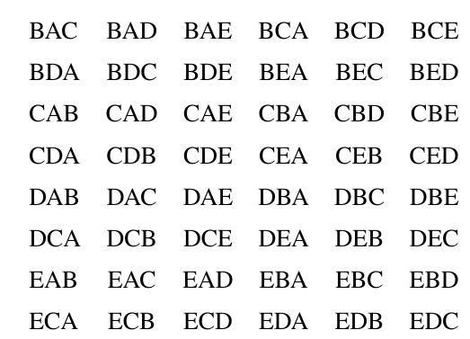
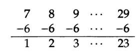
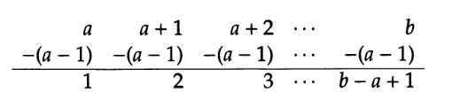
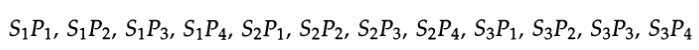
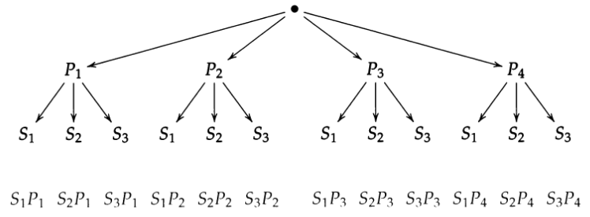
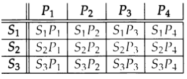
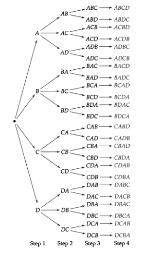
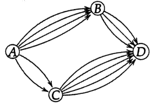

# Contagem 

# Introdução

## O que é combinatória ?

Combinatória é a matemática de contagem. Alguns problemas que são de interesse da combinatória :

1. Se você tem 5 livros e deseja colocar 3 em uma estante, de quantas maneiras isso pode ser feito ?
2. Se você tem n livros e deseja colocar k em uma estante, de quantas maneiras pode ser feito?
3. Quantas palavras de tamanho n podem ser construídas do alfabeto {a,b} tal que não haja nenhuma palavra com dois 'a' adjacentes ?
4. De quantas formas n casais compostos por duas pessoas , uma do sexo feminino e outra do sexo masculino, podem sentar em uma mesa circular 

Uma forma de resolver o exemplo 1 seria questionar se a ordem em que os 3 livros são colocados na instante é importante ou se deveríamos selecionar qual dos livros colocar. Se todos os livros são diferentes, podemos assumir para cada livro uma letra , o conjunto desses 5 livros pode ser representado como {A,B,C,D,E}. A lista de possibilidades será listada abaixo, respeitando a ordem das letras como a ordem da organização dos livros na estante.

Começando com o livro A:

$\begin{align}ABC && ABD && ABE && ACB && ACD && ACE \\ ADB && ADC && ADE && AEB  && AEC &&  AED\end{align}$

Combinações restantes:

Apesar dessa abordagem ser intuitiva e clara, fazer isso para valores cada vez maiores levaria um tempo absurdo. Se tiver de organizar 10 livros em 5 lugares de uma estante, haveria 30,000 possibilidades de se fazer, o que não é agradável por meio da força bruta (listar todas as combinações).

## Contagem é aritmética ( Capítulo alternativo)

### Lista de números

#### Problema 1

Quantos números há na lista abaixo ?

> 1, 2, 3, 4, 5, 6, 7, 8, 9, 10, 11, 12, 13, 14, 15, 16, 17, 18

Podemos claramente ver que há apenas 18 itens.

#### Problema 2

Quantos números há entre o número 7  e 29 (incluindo esses dois números) ?

> 7, 8, 9, 10, 11, 12, 13, 14, 15, 16, 17, 18, 19, 20, 21, 22, 23, 24, 25, 26, 27, 28, 29

Uma abordagem seria contar os números um por um e perceber que há 23 números. Outra abordagem inteligente seria tornar essa sequência igual a sequência do problema 1, que fornece automaticamente um significado claro que envolve tanto a sequência quanto sua quantidade de itens.

Podemos transformar essa lista subtraindo de cada item 6 unidades :

Então dessa nova lista tiramos a conclusão de que há 23 itens na lista original. Percebe-se que o mesmo se consegue fazendo $(29-7)+1$ 

Uma fórmula geral para achar a quantidade números entre a e b ( considerando-os também) , sendo que $b>a$ :

Então, a maior parte dos problemas pode ser resolvida ao converter o problema em problemas mais simples e que tenhamos noção.

#### Problema 3

Texto:

> Quantos múltiplos de 3 há entre 62 e 215 ?

Vemos que $\normalsize \frac{62}{3}=20 \frac{2}{3}$ , então o menor múltiplo de 3 em nossa lista é $3 \times 21 = 63$. De forma parecida , $\normalsize \frac{215}{3}=71 \frac{2}{3}$, então o maior múltiplo de 3 dentro da lista é $3 \times 71 = 213$. Então nossa lista de múltiplos é :

> 63, 66, 69 , ..., 213.

Podemos converter essa lista para uma que conhecemos como contar, podemos dividir cada item por 3:

> 21, 22, 23, ..., 71

E como vimos anteriormente , podemos tornar essa lista mais óbvia ao converter em outra. O que pode ser alcançado subtraindo 20 de cada item:

> 1, 2 , 3, ..., 51 

Então há 51 que são múltiplos de 3 na lista (de 62 a 215). 

Observação :

> O penúltimo e último são relativamente simples. Vamos analisar os múltiplos do número 2 :
>
> $2 \times {\color{red}1};2 \times {\color{red}2}; 2 \times {\color{red}3}; 2 \times {\color{red}4}...$
>
> Isso dá resultado para a seguinte lista de múltiplos :
>
> 2, 4, 6, 8...
>
> Veja que os números em vermelho formam uma sequência que indica a ordem em que os múltiplos aparecem, o número 2 é o $\color{red}1 º$ ( primeiro) múltiplo de 2 , e essa lógica pode ser aplicada para todos os itens dessa sequência. 

#### Problema 4

a) Quantos múltiplos de dez há entre 9 e 101 ?

É fácil notar que a lista de possíveis múltiplos é 10,20,30,40,50,60,70,80,90,100 , ou seja, 10 múltiplos. Poderíamos inclusive dividir cada item por 10 para ordenar na ordem em que aparecem, teríamos  : 1,2,3,4,5,6,7,8,9,10.

b) Quantos múltiplos há entre 11 e 103 ?

A lista de múltiplos agora vai de 20,...,100  , logo são apenas 9 múltiplos. Caso dividir cada item por 10 para ordenar conforme surge , temos : 2, ..., 10 . Nesse caso ainda temos 9 itens.  Poderíamos ainda tornar essa sequência mais natural ao subtrair 1 de cada termo , o que resulta em : 1, ..., 9.

#### Problema 5

Texto:

> Quantos números de 4 dígitos são cubos perfeitos (ex : 27 é um cubo perfeito,pois $3^3=27$.)

Obviamente testar número por número é uma opção inviável. O que podemos fazer é encontrar o menor e o maior número da nossa lista, talvez até encontrar uma forma mais conveniente de contar todos os números entre eles depois disso.

O menor número de 4 dígitos, que é um cubo perfeito, é $1000=10^3$.

O maior número talvez seja um pouquinho mais complicado. Isso exige fazer testes, podemos usar o método de tentativa e erros. Temos a noçao de que $20^3=8000$, então vamos tentar com números depois de 20:

> $21^3=9261 \\ 22^3=10648$

Veja que o número 22 ao cubo ultrapassa o limite da nossa lista, pois resulta em número de 5 dígitos. Nesse caso, o $21^3 = 9261$ é o maior número da nossa lista que contém apenas números de 4 dígitos. Então, nossa lista é :

>  $1000,...,9261$ 

Podemos escrever essa mesma lista assim :

> $10^3,11^3,12^3,...,20^3,21^3$

Claramente podemos notar que a quantidade de números é igual a quantidade números da lista abaixo:

> $10,11,12,...,20,21$

Logo, há 12 números na lista, o que é nossa resposta.

### Contando com adição e subtração

#### Problema 1 

> ​	Numa escola há 12 jogadores em um time de futebol. Todos os jogadores precisam frequentar pelo menos um aula de língua estrangeira. A escola oferece apenas espanhol ou francês como língua estrangeira. 8 dos jogadores assistem aulas de Espanhol e 5 frequentam ambas as aulas de língua. Quantos jogadores fazem Francês.

Os jogadores que frequentam as aulas de Francês podem ser classificados em **duas categorias**: Aqueles que também frequentam aulas de Espanhol, e aqueles que não frequentam as aulas de Espanhol. 

Como dito no texto, **o número de jogadores que frequentam tanto Espanhol quanto Francês é 5.**

Agora precisamos encontrar o número de jogadores que não fazem Espanhol, mas fazem Francês. Veja que há 12 jogadores no time ao todo, sendo que 8 deles fazem Espanhol, então os que não fazem Espanhol é $12-8=4$ . Como cada jogador do time precisa frequentar pelo menos uma aula de idioma estrangeiro, **logo, esses 4 só podem ser os que fazem Francês**.

Então, o total de jogadores que fazem Francês é a soma dessas duas categorias $5+4 = 9$. Nove são os que fazem Francês.

  ### Contando Múltiplos Eventos

#### Problema 1

> Você tem 3 camisas e 4 pares calças. De quantas formas é possível formar um estilo consistindo de uma camisa e um par de calças ?

Se classificarmos as camisas como $ S_{1},S_{2},S_{3}$ e os pares de calças como $P_{1},P_{2},P_{3},P_{4}$ .Poderíamos listar cada combinação :

 

Então há 12 combinações possíveis.

Entretanto, fazer isso pode ser meio chato ou não permitir um raciocínio fluído. Podemos visualizar melhor essa situação desenhando uma árvore com as combinações.

Ou podemos desenhar uma tabela :

Das duas figuras podemos tirar as seguintes conclusões : Temos 4 opções de calças, e para cada uma dessas quatro opções de calças, temos 3 opções de camisa. Então há $4\times 3=12$ estilos possíveis.

> Caso não tenha entendido a explicação de $4 \times 3$ para encontrar todos os estilos possíveis, podemos pensar da seguinte forma.
>
> 1 calça pode combinar com 3 camisas $\longrightarrow$  $1 P \times 3S$
>
> Como temos 4 calças, então temos essa situação se repetindo 4 vezes $\longrightarrow$  $4(1P \times 3S)$ 
>
> Logo, temos :   $12$

#### Problema 2

> De quantas maneiras podemos formar uma comissão internacional se devemos escolher um país europeu dentre 6 países, uma país asiático dentre 4, um país norte-americano dentre 3, e um país africano dentre 7?

Desenhar uma árvore ou uma tabela não será muito útil, visto que temos muitas opções. Então, temos que seguir um raciocínio com base no que foi visto anteriormente.

> Passo 1 : Há 6 formas de escolher um país europeu.
>
> Passo 2 : Para cada país europeu, podemos escolher um país asiático de 4 maneiras, um total de $6\times 4 = 24$  maneiras de escolher ambos, um país europeu e um país asiático.
>
> Passo 3 : Para cada par de países  que escolhemos no passo 1 e no passo  2, podemos escolher um país norte-americano de 3 formas. Então, há $24 \times 3 =72$ formas de escolher os 3 países até então.
>
> Passo 4 : Para esses três países que escolhemos até agora (Passo 1-3), podemos escolher um país africano de 7 formas. Então, há $72\times 7= 504$ maneiras de escolher 4 países.
>
> Então,resumindo, existe $6\times 4 \times 3 \times 7 =504$ possibilidades.

#### Problema 3

> De quantas maneiras podemos organizar 4 livros numa estante ?

Veja que não podemos apenas fazer $4 \times 4 \times 4 \times 4$ , pois quando colocarmos o primeiro livro na estante, haverá apenas 3 escolhas para o segundo livro. 

>  Passo 1 : Temos 4 escolhas para o primeiro livro.
>
> Passo 2 : Temos 3 livros disponíveis agora, então 3 escolhas para o segundo livro. Então, temos um total de $4 \times 3 =12 $ possibilidades para os dois primeiros livros.
>
> Passo 3 : Temos 2 livros disponíveis agora, então há 2 escolhas para o terceiro livro. Então, temos o total de $12 \times 2 = 24$ possibilidades para os três primeiros livros.
>
> Passo 4 : Temos 1 livro disponível, então há apenas 1 escolha para o quarto livro. Então, temos um total de $24 \times 1 = 24$ possibilidades para os quatro primeiros livros, ou seja, para todos os livros.

A resposta , portanto, é 24. $\square$

Devemos nos atentar ao fato de que os eventos de escolha não são independentes, a escolha de um livro depende da escolha passada. Sempre teremos 3 livros para escolher no Passo 2 devido ao Passo 1, e sempre teremos 2 livros para escolher no Passo 3 devido ao Passo 2. Então, a escolha feita previamente influencia nas futuras demais. O interessante é que poderíamos ter chegado na resposta fazendo a multiplicação do número de opções em cada passo como $4 \times 3 \times 2 \times 1 = 24$.

Podemos representar nossas escolhas numa  árvore, onde os livros são A,B,C e D.

  

#### Problema 4

> Um clube de matemática possui 20 membros. De quantas maneiras podemos selecionar um presidente, um vice-presidente, e um tesoureiro se nenhum membro pode ter mais do que um ofício.

 

Mais uma vez, as escolhas não são independentes. Uma vez que um estudante tiver sido escolhido para ser presidente, essa pessoa não estará disponível para ser vice-presidente ou tesoureiro.

Temos 20 escolhas para presidente. Uma vez que escolhermos um presidente, temos 19 pessoas sobrando para escolher pro cargo de vice-presidente ou tesoureiro. Depois de escolhermos  presidente e  vice-presidente, temos 18 pessoas sobrando para serem escolhidas para a posição de tesoureiro.

Então, há $20 \times 19 \times 18 = 6840$ formas de preencher essas três posições. $\square$

Esses dois últimos exemplos são exemplos do que chamamos de permutação. A permutação ocorre quando precisamos escolher itens de um grupo maior apenas um de cada vez.   

#### Problema 5

> Um clube possui n membros , onde n é um inteiro positivo. De quantas maneiras podemos escolher r diferentes cargos para o clube (r é positivo e menor que n),de tal forma que um membro não poder ter mais do que um cargo ?

Para preencher a primeira vaga teremos n opções

Para preencher a segunda vaga teremos n - 1 escolhas, visto que alguém já foi escolhido antes, então essa pessoa não pode mais concorrer por uma vaga.

Temos n-2 escolhas sobrando para a terceira vaga, pois já escolhemos duas pessoas antes, e elas não podem mais ser escolhidas.

E assim se segue.

Resumindo :

> $(n)(n-1)(n-2)(n-3)(n-4)...3 \times 2\times 1$

Usando números, podemos perguntar : E para 7 membros, de quantas formas podemos delegar cargos ?

Temos 7 escolhas para o primeiro cargo, 6 escolhas para o segundo, 5 para o terceiro, 4 para o quatro ...

Resumindo :

> $(7)\times(6)\times(5)\times(4)\times(3)\times(2)\times(1)$

É uma conta meio grande, mas podemos denotar isso por :

> $7! = 7 \times 6 \times 5 \times 4 \times 3 \times 2 \times 1$ 

Essa notação 7! resume essa conta, indicando que teremos várias multiplicações de termos sequenciais , essa notação é conhecida como fatorial.

Mais exemplos :

> $3! = 3 \times 2 \times1 $
>
> $9!=9\times8\times7\times6\times5\times4\times3\times2\times1$
>
> $5!=5\times4\times3\times2\times1$

Nem sempre queremos expandir todo o fatorial, e não precisamos :

> $5!=5\times4\times3\times2\times 1$
>
> $6!=6\times5\times4\times3\times2\times1$
>
> Veja que em 6!, temos :
>
> $6\color{orange}\times5\times4\times3\times2\times1$
>
> Essa parte em laranja é idêntica ao 5!. Portanto,  podemos escrever 6! como :
>
> $6! = 6 \times 5!$
>
> Não há problema algum.

Observação :

> Por convenção 0! é igual a 1.

# Técnicas Básicas de Contagem

## Casos de Análise

### Problema 1

> A figura representa a rota entre 4 vilas ( A, B, C, D).Cada setas indica um caminho possível para ir de uma vila para outra. De quantas maneiras podemos ir de A até D através desses caminhos, se só podemos nos mover da esquerda para direita?( Por exemplo, não poderíamos ir ABABACD, só pode ir ACD ou ABD)
>
> 

Nós temos duas opções gerais, podemos ir por B ou por C. Temos que passar por um deles e somente um, não ambos. Então, falamos que essas duas escolhas são **exclusivas**, pois temos de escolher uma ou outra, mas não ambas.

Nossas escolhas **exclusivas** formam dois casos :

​	Primeira Caso : Ir de A até D passando por B

> Há 4 formas de conseguir ir de A até B ( Veja a quantidade de flechas ligando os caminhos), e 3 formas de ir de B até D. Então, temos $4 \times 3 =12$ maneiras de ir de A até D passando por B.

​	Segundo Caso : Ir de A até D passando por C

> Há 2 formas de conseguir ir de A até C, e 5 formas de ir de B até D. Então, temos $2 \times 5 = 10$ formas de ir de A até D passando por C.

Para contar o total de maneiras de ir de A até D, devemos adicionar o número de formas de cada um dos nossos casos. Há 12 formas de passando por B e outras 10 formas passando por C, logo existe o total de $12+10=22$ formas de ir de A até D. $\square$ 

Para escolher o caminho de A até D passando por B, escolhemos o caminho de A até B, **e** escolhemos o caminho de B até D, então nós **multiplicamos** o número de caminhos de A até B pelo número de caminhos de B até D.

Para escolher o caminho de A até D passando por C, escolhemos o caminho de A até C, **e** escolhemos o caminho de C até D, então nós **multiplicamos** o número de caminhos de A até C pelo número de caminhos de C até D. 

> Conceito :
>
> Quando temos uma série de eventos independentes, um após o outro, nós **multiplicamos** o número de opções de cada passo.
>
> Quando temos opções exclusivas - não podemos escolher mais de uma - , nós **adicionamos** o número de opções.
>
> Nesse Problema 1, um exemplo de opções exclusivas era a escolha de ir de A até D, pois tínhamos que escolher entre passar por B ou por C, fisicamente é impossível passar por ambos ( C e B).

### Problema 2

> Na ilha de Mumble, o alfabeto Mumbliano possui apenas 5 letras, e toda palavra na língua Mumbliana possui o tamanho máximo de 3 letras. Quantas palavras são possíveis ? ( A palavra pode usar uma letra mais de uma vez, mas 0 letras não conta como palavra.)

Nossos casos podem ser de acordo com o tamanho da palavra :

​	Caso 1 : Palavras com 1 letra 

>  Como temos 5 letras no alfabeto, cada letra pode formar uma palavra cujo tamanho  é 1. Então, teríamos 5 palavras compostas com uma letra.

​	Caso 2 : Palavras com 2 letras 

> Para formar uma palavra com tamanho 2 (letras), temos 5 opções para a primeira letra **e** temos 5 opções para a segunda letra (é permitido, pois podemos repetir letras do alfabeto). Logo, há $5 \times 5 =25$ palavras com tamanho 2 possíveis.

​	Caso 3 :  Palavras com 3 letras

> Para formar palavras com tamanho 3 (letras), temos 5 opções para nossa primeira letra **e** 5 opções para nossa segunda letra e **5** opções para nossa terceira letra. Logo, temos $5 \times 5 \times 5 = 125$ palavras com tamanho 3 possíveis.

Resumindo, podemos formar 5 palavras de tamanho um **ou** 25 palavras de tamanho dois **ou** 125 palavras de tamanho três. Portanto, podemos formar $5+25+125 = 155$ palavras. 

>  Os casos são exclusivos, por isso somamos o número de opções possíveis. Uma justificativa para serem exclusivos é a de que não podemos formar palavras com 1 letra e ao mesmo tempo formar com 2 letras e simultaneamente formar com 3 letras.

> Note no terceiro caso, por exemplo, tivemos de escolher a primeira letra **e** a segunda letra **e** a terceira letra, então multiplicamos esses passos. Entretanto, quando escolhendo a palavra como um todo de acordo  com seu tamanho, tivemos que escolher entre palavras de uma letra **ou** palavras com 2 letras **ou** palavras com 3 letras, então somamos.

### Problema 3

> Os habitantes da ilha de Mumble decidiu expandir seu alfabeto para o alfabeto romano(26 letras,A-Z). Mas eles continuam limitando o limite de suas palavras para 3 ou menos letras, e por alguma razão, eles insistem que todas as palavras contenham a letra A pelo menos uma vez. Quantas palavras de 3 letras são possíveis ?
>
> (Esse exemplo será revisitado  na próxima seção)

Para solucionar esse problema vamos quebrar em casos possíveis que contenha pelo menos um A. Temos os seguintes casos :

Palavras com 3 letras com 1 A :

1. $A \star \star$

   Temos 25(todo o alfabeto tirando A) escolhas para a segunda letra e 25 escolhas para a terceira letra, fazendo $25 \times 25 = 625$ palavras.

2. $\star A \star$

   Temos 25(todo o alfabeto tirando A) escolhas para a primeira letra e 25 escolhas para a terceira letra, fazendo $25 \times 25 = 625$ palavras.

3. $\star \star A$

   Temos 25(todo o alfabeto tirando A) escolhas para a primeira letra e 25 escolhas para a segunda letra, fazendo $25 \times 25 = 625$ palavras.

Obs : $\star$ significa que é uma letra diferente de A.

Temos o total de $625+625+625=1875$ palavras de 3 letras com 1 A.

Palavras com 3 letras com 2 A:

1. $AA\star$

   Temos 25 escolhas para a terceira letra.

2. $\star AA$

   Temos 25 escolhas para a primeira letra.

3. $A\star A$

   Temos 25 escolhas para a segunda letra.

Então, temos $25+25+25=75$ palavras com 3 letras com 2 A.

Palavras de 3 letras com 3 A:

Obviamente só temos uma palavra : AAA. 

Ao todo :
$$
\text{Palavras com 3 letras com 1 A} + \text{Palavras com 3 letras com 2 A} + \text{Palavras com 3 letras com 3 A}
$$
Logo :
$$
1875+75+1=1951 \text{ palavras de 3 letras contendo A}
$$

## Contagem complementar

o termo contagem complementar se refere ao que não queremos contar. Isso pode ser mais fácil do que contar o que queremos.

### Problema 1

> Os habitantes da ilha de Mumble decidiu expandir seu alfabeto para o alfabeto romano(26 letras,A-Z). Mas eles continuam limitando o limite de suas palavras para 3 ou menos letras, e por alguma razão, eles insistem que todas as palavras contenham a letra A pelo menos uma vez. Quantas palavras de 3 letras são possíveis ?
>
> (Exemplo repetido, porém com outra solução)

Vamos fazer assim : contar todas as palavras de 3 letras que não têm A e subtrair do total de palavras de que podem ser formadas com 3 letras. Dessa forma, saberemos o total de palavras com 3 letras que contém pelo menos um A. 

Quantas palavras de 3 letras não possuem A ?

Se as palavras são da seguinte forma $\star \star \star $, onde cada $ \star$ precisa ser diferente de A. Então, temos 25 (Todo o alfabeto tirando A) escolhas para a primeira letra, 25 escolhas para a segunda letra e 25 escolhas para a terceira letra. Logo, temos $25\times25\times25=25^3=15625$ palavras com 3 letras sem A.

Quantas palavras de 3 letras (sem qualquer restrição como "não conter A") podem ser formadas ?

Temos 26 escolhas ( Alfabeto inteiro) para a primeira letra, 26 escolhas para a segunda letra e 26 escolhas para a terceira letra, fazendo $26 \times 26\times 26 =26^3=17576$ palavras com 3 letras.

Então, para saber a quantidade de palavras de 3 letras com pelo menos um A, calculamos :
$$
(\text{palavras 3-letras})-(\text{palavras 3-letras sem A})=17576-15625=1951
$$
Então temos 1951 palavras com 3 letras que contém pelo menos um A.

> O que foi feito pode ser entendi também em noções de conjuntos. 
>
> Como uma palavra de 3 letras pode conter ou não conter A, pois é impossível conter e não conter A ao mesmo tempo, então temos dois conjuntos : conjunto que contem A e conjunto que não contem A . A união desses conjuntos são todas as palavras de 3 letras que podem ser formados.
>
> Para exemplificar vamos aplicar isso para um alfabeto menor, que contenha A,B,C. Quantas palavras de 2 letras que contenha pelo menos um A podem ser formados ?
>
> Passo 1 : O total de palavras com 2 letras sem restrição seria 9 : $3\times3=9$ , pois temos 3 escolhas (A,B,C) possíveis para a primeira letra e 3 escolhas para a segunda letra.
>
> Passo 2 : O total de palavras com 2 letras que não contém A : $2 \times 2 = 4$, pois temos 2 escolhas(B,C) possíveis para a primeira letra e 2 escolhas possíveis para a segunda letra.
>
> Passo 3 : Logo, o total de palavras com 2 letras com pelo menos um A : $9-4=5$ palavras.
>
> Podemos listar todas as combinações para visualizar melhor:
>
> Passo 1 :
>
> > AA	AC	BA
> >
> > AB	CA
>
> > BB	BC	
> >
> > CC	CB
>
> Podemos ver que uma palavra com 2 letras pode conter A ou não conter A e a soma desses dois conjuntos resulta em todas as palavras com 2 letras possíveis.
>
> Passo 2 : 
>
> > BB	BC	
> >
> > CC	CB
>
> Isso foi exposto na visualização do Passo 1. Essa lista contém 4 palavras.
>
> Passo 3 :
>
> > AA	AC	BA
> >
> > AB	CA
>
> Isso foi exposto na visualização do Passo 1. Essa lista contém 5 palavras. 

### Problema 2

> Quantos números menores que um bilhão contém o dígito 1?

Caso fossemos contar todos os casos que contém 1 :

1. $\star\star\star\star\star\star\star\star1$
2. $\star\star\star\star\star\star\star 1 \star$
3. $\star\star\star\star\star\star 1 \star\star$
4. $\star\star\star\star\star 1 \star\star\star$
5. $\star\star\star\star 1\star\star\star\star$
6. $\star\star\star 1 \star\star\star\star\star$
7. $\star\star 1 \star \star\star\star\star\star$
8. $\star 1 \star \star \star\star\star\star\star$
9. $1 \star\star\star \star\star\star\star\star$

De fato, seria problemático contar caso por caso onde poderia ter 1, o mais simples é contar o que não queremos, sabemos que dentro do total de números que é 1 bilhão(0-1 bi), os números podem conter ou não conter 1.

Então :
$$
\text{numeros com 1} + \text{numeros sem 1} = total
$$
Podemos achar os números que possuem pelo menos 1 em alguma posição :
$$
\text{numeros com 1} = total - \text{numeros sem 1}
$$
Quantos números sem 1 é possível ?

Bem, levando em consideração a forma de um número como o bilhão :
$$
\star \star\star\star \star\star\star\star\star
$$
Onde $\star $ é um número diferente de 1. Temos 9 escolhas(0,2,3,4,5,6,7,8,9) para a primeira posição , 9 escolhas para segunda, 9 escolhas para a terceira posição e isso se segue para todas as posições que formam um total de 9 posições. Dessa forma temos :
$$
9 \times 9 \times 9 \times 9 \times 9 \times 9 \times 9 \times 9 \times 9 = 9 ^9
$$
Então, temos $9^9$ números que não contém 1.

> Pode parecer estranho, mas como consideramos o zero como opção, então temos as seguintes combinações possíveis :
>
> * 000000000
> * 000000001
> * 000000002
> * 000000003
> * 000000010
> * 000000023
> * 000000234
> * ...

O total de números é 1 bilhão, pois temos de 0 até 999999999.

Logo, o total de números que contém 1 pelo menos uma vez é :
$$
\text{numeros com 1} = total - \text{numeros sem 1} \\
\text{numeros com 1} = 1 \text{ bi} - 9^9 \\
\text{numeros com 1} =  1000000000 - 387420489
$$
Então, o resultado é :
$$
1000000000 - 387420489 = 612579522
$$
Logo, há 612579522 números menos do que um bilhão cuja composição tenha menos uma vez o dígito 1.

# Correção de super-contagem

   Muitas vezes é conveniente contar demais e depois tirar esse excesso. Já fizemos coisa do tipo na seção de Contagem Complementar, onde subtraímos as contagens não desejadas.

Entretanto, existe outros métodos de contar que envolve uma super-contagem e então corrigir essa contagem em excesso. Diferente do método apresentado em Contagem Complementar, no qual usamos subtração, os métodos discutidos aqui envolvem o uso da divisão para a correção de um excesso de contagem. 

