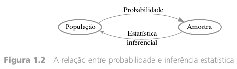

# Estatística 

# Introdução

## Definição

Segundo Ron Larson, Betsy Farber :

> Estatística é a ciência que coleta, organiza, analisa e interpreta dados para a tomada de decisões 

## Conjunto de dados 

Há dois tipos de conjuntos de dados usados em estatística :

1. População
2. Amostra

Uma **população** é uma coleção de todos os os resultados, respostas , medições ou contagens que são de interesse.

Uma **amostra** é um subgrupo (subconjunto) da população.

Uma coleção pode ser tanto população quanto amostra dependendo da perspectiva. Por exemplo, você pode analisar o peso de 50 alunos do sexo masculino de uma turma como população , pois está preocupado com o excesso de peso numa excursão a barco, ou, pode ver essa coleção de pesos como uma amostra porque você deseja generalizar os pesos de todos os alunos do sexo masculino. 

**Exemplo 1**

> "Em uma pesquisa recente , foi perguntado a 1.708 adultos americanos se eles consideram o aquecimento global um problema que exige uma ação imediata do governo. Novecentos e trinta e nove deles responderam sim. " (Ron Larson)
>
> A **população** consiste das respostas de todos os adultos nos Estados Unidos, e a **amostra** consiste das respostas de 1.708 adultos nos Estados Unidos na pesquisa. *A amostra é um subconjunto das respostas de todos os adultos do EUA*. O conjunto de dados consiste de 939 sim e 769 não.

Normalmente estamos interessados apenas em certas características dos objetos de uma população como a idade de um indivíduo que se formou em engenharia, o sexo de uma formando de engenharia etc. Uma característica pode ser *categorizada* , como sexo ou tipo de defeito , ou pode ter *natureza numérica*, como a idade ou diâmetro. Uma **variável** é qualquer característica cujo valor pode mudar de um objeto para outro na população. É comum usar letras minúsculas do final do alfabeto. 

Exemplos de variáveis.

> x = marca da calculadora de um estudante.
>
> y = números de defeitos graves em um automóvel recentemente fabricado.
>
> z = distância de frenagem de um automóvel sob condições especificadas.

## Ramos da estatística

Há duas ramificações consideráveis :

1. Estatística Descritiva
2. Estatística Inferencial

A **estatística descritiva** envolve a organização, o resumo e representação dos dados. 

A **estatística inferencial** envolve o uso de uma amostra para chegar a conclusões sobre uma população. Uma ferramenta básica dessa área é a probabilidade.  

A probabilidade faz suas considerações da população para a amostra (raciocínio dedutivo) e a inferência estatística faz considerações da amostra para a população (raciocínio indutivo)

### Exemplos

1 ) Indique se o tipo de estatística dos exemplos a seguir é descritiva ou inferencial:

a) Os estudantes na minha sala de estatística têm, em média, 23 anos.

* Descritiva

b) A população do mundo excede 7 bilhões.

* Inferencial 

c) 4 ou 8 anos tem sido o tempo mais frequente de mandato dos presidentes do EUA .

* Descritiva

## Tipos de dados

A natureza dos dados com os quais estamos trabalhando determinará qual procedimento estatístico pode ser usado. O conjunto de dados podem ser do tipo:

1. Dados Qualitativos 
2. Dados Quantitativos 

Exemplo de dados qualitativos :

* A cor dos olhos
* O nome de um partido político
* O tipo de transporte usado para viajar ao trabalho

Exemplo de dados quantitativos :

* O tamanho dos tênis
* O preço de uma casa
* Peso de uma pessoa
* O número de semestres estudados