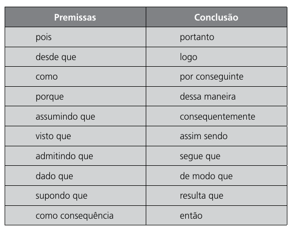
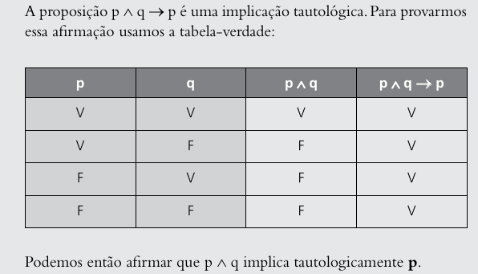

# Introdução À Lógica

Segundo Cezar A. Mortari:

> Lógica é a ciência que estuda princípios e métodos de inferência, tendo o objetivo principal de determinar em que condições certas coisas se seguem (são consequência), ou não, de outras.

Segundo John Nolt,Dennis Rohatyn:

> Lógica é o estudo de argumentos. Um argumento é uma sequência de enunciados na qual um dos enunciados é a conclusão e os demais são premissas, as quais servem para provar ou, pelo menos, fornecer alguma evidência para a conclusão.

# Lógica e Argumentos

## Validade e Forma

$(A_{1})$ 

> $P_{1}$    Todo gato é mamífero.
>
> $P_{2}$ 	Miau é um gato.
>
> $\blacktriangleright$ 	 Miau é um mamífero.

$(A_{2})$

> *Considerando Lulu como cachorro*:
>
> $P_{1}$    Todo gato é mamífero.
>
> $P_{2} $    Lulu é um mamífero.
>
> $\blacktriangleright$     Lulu é um gato.

($A_{3}$)

> *Considerando Cléo como um peixinho dourado*:
>
> $P_{1} $	Todo peixe é dourado.
>
> $P_{2}$	Cléo é um peixe.
>
> $\blacktriangleright$ 	Cléo é dourado. 

[^1]: Esse símbolo indica a conclusão do raciocínio, alguns autores usam  $\therefore$  ou $\vdash$ \(traço de asserção). O traço de asserção é para operações horizontais.

A conclusão de $A_{1}$ é evidentemente correta, "Miau" é um mamífero é adequadamente justificado pelas premissas : sendo Miau um gato, a afirmação de que todo gato é um mamífero também o inclui; assim, ele não tem como não ser mamífero.

Observe no $A_{2}$ , a conclusão está errada , apesar de as premissas serem verdadeiras. Lulu é uma mamífero de fato, entretanto, não é um gato , isso logicamente é suportado pela existência de inúmeros mamíferos. Assim, mesmo que as premissas sejam verdadeiras, não são suficientes para justificar a conclusão.

Em $A_{3}$ , apesar da conclusão ser verdadeira, pois Cléo é um peixe dourado, não seria correto dizer que a conclusão está sustentada com base nas premissas apresentadas, visto que nem todo peixe é dourado, há peixes de cores variadas. Logo, uma proposição falsa não é uma boa justificativa para outra proposição.

Podemos generalizar esses exemplos com a seguinte forma:

$ (F1) $

> $P_{1}$	Todo A é B.
>
> $P_{2}$	c é A. 
>
> $\blacktriangleright$	c é B

A forma do $A_{2}$ pode ser generalizada por:

$(F2)$

> $P_{1}$	Todo A é B.
>
> $P_{2}$	c é um B.
>
> $\blacktriangleright$	c é A.

Todo argumento na forma $F1$ é considerado válido, enquanto que todo argumento na forma $F2$ é inválido.

Veja que em $A_{1},A_{3}$, as premissas são verdadeiras e a conclusão é consequência lógica de suas premissas, logo , são argumentos válidos. Entretanto, em $A_{2}$ , apesar das premissas serem verdadeiras , a conclusão não é consequência lógica de suas premissas. 

Definição de argumento válido segundo Cezar:

> Um argumento é válido se qualquer circunstância que torna suas premissas verdadeiras faz com que sua conclusão seja automaticamente verdadeira.

Reforçando: Se um argumento é válido, dizemos que sua conclusão é consequência lógica de suas premissas. O que não pode ocorrer também é ter premissas verdadeiras e a conclusão falsa como em $A_{2}$, nesse caso o argumento é inválido.

# Cálculo Proposicional 

É a parte da lógica matemática que estuda a validade dos argumentos apresentados, em uma linguagem própria, a linguagem proposicional. 

## Proposição

Uma proposição ou enunciado  é uma sentença declarativa que pode ser verdadeira(V) ou falsa(F) .

Isso exclui exclui sentenças interrogativas, exclamativas , imperativas.

Exemplos de proposições:

> * $sen(90)º$ é igual a 1 ( Proposição verdadeira)
> * Júpiter está a 100 km da Terra (Proposição falsa) 

Exemplos de não-proposições:

> * Venha aqui! (Sentença imperativa)
> * Não corra tão rápido (Sentença imperativa)
> * Pela mãe do guarda (Sentença exclamativa)
> * Quantas vezes terei que repetir isso? (Sentença interrogativa)
>
> Essas sentenças não são proposições, pois é impossível estabelecer um valor-verdade para elas.

O cálculo proposicional se preocupa apenas com a relação entre as proposições e não com o conteúdo de cada, ou seu significado. 

As proposições podem ser substituídas por letras maiúsculas do alfabeto latino.

Exemplo:

> 1. Os suíços fabricam os melhores relógios e os franceses, o melhor vinho.
>
>    Podemos colocar da seguinte forma :  
>
>    * R = "Os suíços fabricam os melhores relógios"
>    * P = "Os franceses fabricam o melhor vinho"
>
>    Então teremos: R e P.
>
> 2.  Se prestar atenção na aula , então tirarei boas notas nas provas. 
>
>    Podemos colocar da seguinte forma:
>
>    * A = "Eu prestar atenção na aula"
>    * S = "Eu tirarei boas notas nas provas"
>
>    Então teremos: Se A, então S.

### Princípios da Lógica Clássica

A lógica matemática segue alguns princípios como regras fundamentais:

* Princípio da Identidade

  > "Toda proposição é idêntica a si mesma"
  >
  > P é P

* Princípio da Não Contradição

  > "Uma proposição não pode ser verdadeira e falsa ao mesmo tempo"
  >
  > não(P e não P)

* Princípio do Terceiro Excluído:

  > "Toda proposição ou é verdadeira ou é falsa , não existindo um terceiro valor que possa assumir"
  >
  > P ou não P (ou exclusivo)

### Conectivos Proposicionais 

* e ( $ \wedge $ )
* ou ( $ \vee $)
* se..., então ... ( $\implies$ )
* se, e somente se ( $\iff$ )
* não ( $\neg$ ou $\sim$)

### Classificação dos Conectivos

#### Conjunção ( $\wedge$  ou 'e' )

É o resultado da combinação de duas proposições ligadas pelo conectivo **e**, e que será simbolizada por $\wedge$ . A conjunção pode ser expressa também por palavras como : *mas, todavia, contudo , no entanto , visto que , enquanto , além disso , embora*.

Exemplo:

a) Maria foi ao cinema e Marta , ao teatro.

> * C = Maria foi ao Cinema.
> * T = Marta foi ao teatro.
>
> Simbolicamente : C $\wedge$ T

b) José é jogador de futebol e Leandro seguiu a carreira de medicina.

> * F = José é jogador de futebol.
> * M = Leandro seguiu a carreira de medicina.
>
> simbolicamente : F $\wedge $ M

c) André foi ao baile, mas Maria ficou em casa.

> * B = André foi ao baile.
> * C = Maria ficou em casa. 
>
> simbolicamente : B $ \wedge $ C

#### Disjunção ($\vee$  ou  'ou')

É o resultado de duas proposições ligadas pelo conectivo "ou" , que será simbolizado por $\vee$ . 

Na linguagem coloquial o "ou" pode ser empregado em dois sentidos "exclusivo" ou "inclusivo".

Exemplo:

> "Paulo é físico ou matemático."
>
> Caso o "ou" fosse inclusivo , Paulo tanto poderia ser físico como matemático.
>
> Caso o "ou" fosse exclusivo, Paulo não poderia ser físico e matemático ao mesmo tempo. 

No cálculo proposicional, o "ou" inclusivo é o mais abordado. 

Exemplos:

a) $P_{1}$ Hoje é segunda-feira ou terça-feira.

​	$P_{2}$ Hoje não é segunda-feira.

​	$\blacktriangleright$ Hoje é terça-feira.

> ​	Numa sentença disjuntiva( proposição com conectivo "ou") precisa que ao menos uma de suas proposições simples seja verdade. 
>
> Q = Hoje é segunda-feira.
>
> P = Hoje é terça-feira.
>
> Para a frase ser verdadeira precisamos que entre Q e P , pelo menos um deles precisa ser verdade. Como $P_{2}$ nega Q , então P precisa ser verdade.

b) $P_{1}$ Ele é menor de 18 anos ou ele é jovem.

​	$P_{2}$ Ele não é menor de 18 anos.

​	$\blacktriangleright$ Ele é jovem.

> Veja que o exemplo b segue a mesma forma do exemplo a. Essa forma pode ser generalizada para:
>
> $P_{1}$ P ou Q
>
> $P_{2}$ Não P
>
> $\blacktriangleright$ Q.
>
> Pode-se ser lida como "ou P ou Q; não P; portanto Q.". 
>
> Essa forma é conhecida como silogismo disjuntivo. 
>
> Observação: Q e P são conhecidos como *disjunctos*.

#### Condicional ($\implies$)

Caso uma frase possa ser disposta da seguinte forma:

> Se (proposição 1) , então (proposição 2).

O símbolo utilizado para ligar as duas proposições é $\implies$.

A única forma de uma condicional ser falsa é quando $P_{2}(F)$ quando $P_{1}(V)$ . 

Exemplo:

a) Se Alberto é poliglota, então fala várias línguas. 

> P = Se Alberto é poliglota.
>
> Q = Fala várias línguas. 
>
> Simbolicamente : P $\implies$ Q 

b) Se Fernando é inteligente, eu sou um gênio. 

> F = Fernando é inteligente.
>
> E = Eu sou um gênio.
>
> Simbolicamente : F $\implies$ E 

c) Se todos os homens são mortais e Sócrates é um homem, então Sócrates é mortal.

> H = Todos os homens são mortais.
>
> S = Sócrates é um homem.
>
> M = Sócrates é um mortal.
>
> Simbolicamente : $(H \wedge S)\implies M$
>
> Observação : Parênteses indica a ordem de operação. 

d) Se você está morto, então você está vivo.

> Apesar de ser paradoxal, para uma condicional ser falso depende apenas de que a primeira setença seja verdadeira, enquanto que a segunda seja falso. 
>
> Como "você está morto" é falso, mas "você está vivo" é verdadeiro, temos que a frase em si está logicamente correta. 

e) Se você está morto, então você pode correr na velocidade da luz 

> Relembrando que para uma condicional , $p_{1} \implies p{_2}$,  ser falsa, $p_{2}$ precisa ser falsa quando $p_{1}$ for verdadeiro. 
>
> Logo, se ambos $p_{1},p_{2}$ são falsos, a setença continua logicamente correta. 

Frases Inválidas:

a) $P_{1}$ Se você está dançando na Lua, então você está vivo.

​	$P_{2}$ Você está vivo.

​	$\blacktriangleright$ Você está dançando na Lua.

> ​	As premissas são verdadeiras , entretanto, a conclusão é falsa , logo é o argumento é inválido.

b) $P_{1}$ Se jogamos bem, ganhamos.

​	$P_{2}$ Nós ganhamos.

​	$\blacktriangleright$ Jogamos bem.

> Esse exemplo b segue a mesma forma que o exemplo a. Essa forma é conhecida como *afirmação do consequente*.
>
> Observação : "Se P, então Q ." , consideramos P como sendo antecedente e Q como consequente.

c)  $P_{1}$ Se as baleias são peixes, então elas vivem na água.

​	$P_{2}$ As baleias vivem na água.

​	$\blacktriangleright$ As baleias são peixes

> Essa forma é mais um exemplo de *afirmação do consequente*.

#### Bicondicional ($\longleftrightarrow$)

Toda proposição que pode ser colocada da seguinte forma:

> (proposição 1) se, e somente se (proposição 2)

A conexão entre as duas proposições é simbolizada por $\longleftrightarrow$.

A bicondicional pode ser entendida como a conjunção de duas condicionais , ou seja :

> $p \longleftrightarrow q$ pode ser entendido como $p \implies q$ e $q \implies p$ . 

Logo, uma bicondicional só é verdadeira nos casos em que $p,q$ posuem o mesmo valor verdade (V ou F).

Exemplos:

a) Só ganharás o dinheiro se completares o trabalho.

> Ganharás o dinheiro se, e somente se , completares o trabalho.  
>
> D = Ganharás o dinheiro.
>
> T = Completares o trabalho.
>
> Simbolicamente: $D \longleftrightarrow T$ .

#### Negação ( $ \neg $)

Não conecta duas proposições, mas simplesmente nega a afirmação da proposição que o precede. 

É um conectivo unário ( Caso fosse binário , ligaria duas proposições).

Se uma proposição P é verdadeira , então a sua negação(não P) resulta em falsa e vice-versa. Simbolizado por "$ \neg$".

Exemplos:

a) Luís não recebeu seu pagamento na data prevista.

> Se P = Luís recebeu seu pagamento na data prevista, então $\neg$P = Luís não recebeu seu pagamento na data prevista.

b) Alfredo não gosta de trabalhar.

> Se P = Alfredo gosta de trabalhar , então $\neg$P = Alfredo não gosta de trabalhar.

### Formalização

O processo de formalização consiste em converter um conjunto de proposições interligadas em uma estrutura composta de letras proposicionais, conectivos lógicos e símbolos de pontuação.

* Letras proposicionais : A,B,C... ou P$_{1}$ , P$_{2}$ ... ou a,b,c... ou p$_{1}$ , p$ _{2}$. 
* Conectivos Proposicionais : $\neg$ , $\wedge$ , $\vee$ ,$\longrightarrow$,$\longleftrightarrow$ .
* Parênteses: ( ).

Ordem de precedência:

* Operações dentro do parênteses devem ser efetuadas primeiro.
* A ordem de prioridade dos conectivos:

  - 1 º	 $\neg$
  - 2 º    $\wedge \text{ e } \vee$  
  - 3 º   $\longrightarrow$ e $\longleftrightarrow$ 

Exemplos de frases:

1. Interprete a letra sentencial "C" como "Está chovendo" e letra "N" como "Está nevando", e expresse a forma de cada sentença:
   1. Está chovendo.
      * C
   2. Não está chovendo.
      * $\neg$C
   3. Está chovendo ou nevando.
      * $C \vee N$
   4. Está chovendo e nevando.
      * $C \wedge N$
   5. Está chovendo, mas não está nevando.
      * $C \wedge \neg N$
   6. Não está chovendo  e nevando.
      * $\neg(C \wedge N)$
   7. Se não está chovendo, então está nevando.
      * $\neg C \implies N$ 

Observação importante:

> Expressões bem construídas são chamadas de wff(well-formed formulas) ou fórmulas bem-formuladas.
>
> Exemplo de uma expressão mal construída:
>
> $A)) \vee \vee \implies BC$   
>
> Expressão wwf:
>
> $(A \wedge B) \vee (A \wedge C) $ 
>
> Veja como há um respeito pela clareza e formalismo.

#### Algumas palavras importantes

Tenha em mente que ao ler uma frase há certas palavras chaves para formalizar :

#### Formalizando horizontalmente:

a) Se Deus existe, então a vida tem significado. Deus existe. Portanto a vida tem significado. (D,V)

> $D \implies V,D \vdash V$
>
> O traço $\vdash$ indica que uma conclusão de uma linha de raciocínio, ou seja, é a conclusão ou a dedução das premissas, que estão a esquerda.

b) Deus não existe. Pois, se Deus existisse, a vida teria significado. Mas a vida não tem significado. (D,V)

> $D \implies V, \neg V \vdash \neg D$

c) Se o avião não tivesse caído, nós teríamos feito contato pelo rádio. Não fizemos contato pelo rádio. Portanto, o avião caiu. (C,R)

> $\neg C \implies R, \neg R \vdash C$

d) Como hoje não é quinta-feira, deve ser sexta-feira. Hoje é quinta-fera ou sexta-feira. (Q,S)

> $Q \vee S, \neg Q \vdash S$ 

e) Se hoje é quinta-feira, então amanhã será sexta-feira. Se amanhã for sexta-feira, então depois de amanhã será sábado. Consequentemente, se hoje for quinta-feira, então depois de amanhã será sábado. ($Q,S_{1},S_{2}$)

> $Q \implies S_{1},S_{1} \implies S_{2} \vdash Q \implies S_{2}$

f) Hoje é um fim de semana se e somente se hoje é sábado ou domingo. Portanto, hoje é um fim de semana, desde de que hoje é sábado. (F,S,D)

> $F \longleftrightarrow (S \vee D),S\vdash F $   

g) Hoje é um fim de semana se hoje é sábado ou domingo. Mas, hoje não é um fim de semana. Portanto, hoje não é sabado e hoje não é domingo. (F,S,D)

> $S \vee D \implies F, \neg F \vdash \neg S \wedge \neg D$

h) Hoje é um fim de semana somente se hoje é sábado ou domingo. Hoje não é sábado. Hoje não é domingo. Portanto, hoje não é um fim de semana. (F,S,D)

> $F \longleftrightarrow (S \vee D),\neg S,\neg D \vdash \neg F$

i) A proposta de auxílio está no correio. Se os árbitros a receberem até sexta-feira, eles a analisarão. Portanto, eles a analisarão porque se a proposta estiver no correio, eles a receberão até sexta-feira. (C,S,A)

> $C,S \implies A,C \implies S \vdash A$

​	

## Tabela verdade

Para determinar o valor-verdade (V) ou (F) de uma proposição composta, usa-se a tabela verdade , na qual figuram todas as possibilidades para as proposições simples (p e q) que compõem a proposta.

|      |      |  Conjunção   | Disjunção  |  Condicional   | Bicondicional |
| :--: | :--: | :----------: | :--------: | :------------: | :-----------: |
|  p   |  q   | p $\wedge$ q | p $\vee$ q | p $\implies$ q |  p $\iff$ q   |
|  V   |  V   |      V       |     V      |       V        |       V       |
|  V   |  F   |      F       |     V      |       F        |       F       |
|  F   |  V   |      F       |     V      |       V        |       F       |
|  F   |  F   |      F       |     F      |       V        |       V       |

 Tabela para a negação( conectivo unário), tomando **p** como uma proposição simples.

|      | Negação |
| :--: | :-----: |
|  p   | $\neg$p |
|  V   |    F    |
|  F   |    V    |

O número de linhas numa tabela depende do número de proposições simples , sendo $n$ o número de proposições simples, a fórmula para calcular isso é $2^n$. Na primeira tabela temos duas proposições simples $p$ e $q$ , logo temos $2^2$ linhas , ou seja, 4. Na segunda tabela temos apenas uma proposição simples , logo 2 linhas.

Exemplos:

1. Verifique as preposições a seguir:
   1. O Brasil foi colônia de Portugal, mas hoje é um país independente.
      1. 
   2. Vivemos em um país da América Latina, portanto, nosso idioma é proveniente do Latim.
      1. 
   3. Só cursamos a faculdade, se obtivermos aprovação no vestibular. 
      1. P(V) =  Cursaremos a faculdade 
      2. Q(V) = Obtivermos aprovação no vestibular
      3. P $\iff$ Q (V)
   4. Se D. Pedro proclamou a independência do Brasil, ou declarou guerra à Inglaterra, então, o Brasil foi colônia da Inglaterra.  
      1. 

#### Complemento

###### "Ou"

Uma fase composta pelo conectivo "ou" é verdadeira caso tenha pelo menos uma de suas proposições simples como verdade.

Entretanto, se o "ou" for de uso exclusivo, temos:

 

|  P   |  Q   | P $\vee$ Q |
| :--: | :--: | :--------: |
|  V   |  V   |     F      |
|  V   |  F   |     V      |
|  F   |  V   |     V      |
|  F   |  F   |     F      |

O conectivo "ou" com o sentido de exclusivo pode ser denotado formalmente como $(P \vee Q ) \wedge \neg(P \wedge V)$ :

## Classificação Proposicional 

### Tautologia / Tautológica

Uma proposição composta cujo valor lógico é sempre verdade, independente do valor lógico das proposições simples que a compõe.

### Contradição

Uma proposição cujo valor lógico é sempre falso, independente do valor lógico das proposições simples que a compõe.

### Contingência 

O valor lógico da proposição composta pode ser verdadeiro ou falso dependendo do valor lógico de suas proposições simples. 

## Tautologias

### Implicação tautológica

Uma implicação tautológica é uma proposição condicional tautológica

#### Exemplo 1

### Equivalência tautológica 

Quando uma proposição bicondiconal for tautológica, então ela é chamada de equivalência tautológica.

## Consequência Lógica ou Dedução Formal 

# Cálculo de Predicados  ( Cálculo Funcional)

## Introdução

### Termo e Predicado

Em uma proposição simples pode-se destacar dois entes : *o termo e predicado*. O **termo** pode ser entedido como o sujeito da setença declarativa e o **predicado**, o que se declara a respeito do termo.

**Exemplo**

> "Amanda é responsável pelo destaque."
>
> termo : Amanda
>
> predicado: é responsável pelo destaque

**Exemplo 2**

> "Eles foram ao baile."
>
> termo : Eles
>
> predicado : foram ao baile