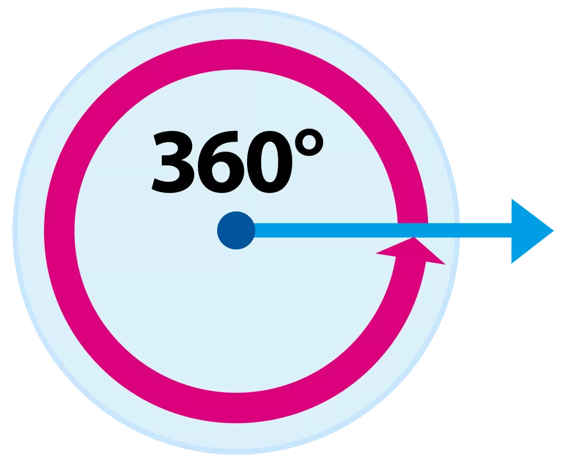

# Ângulos

É o conceito central da trigonometria. Um ângulo é uma figura formada pela união de duas semi-retas com uma origem comum chamada de vértice.

> Origem ou vértice são termos comuns.

Ao se referir à um ângulos, algumas notações podem ser úteis. O ângulo da imagem acima pode ser dito como:

1. AÔB ( A e B são pontos da semi-retas, enquanto que O é o vértice)
2. $\angle AOB$

O primeiro modo deve conter o vértice no meio entre os pontos das semi-retas. Sendo que o vértice,ou ponto comum, deve conter "^".

O segundo modo usa o símbolo $\angle$ , que significa "ângulo", para se referir da mesma forma que o primeiro modo.

# Medida de ângulo

Um ângulo pode ser medido em graus (º) ou em radianos (medida internacional).

## Graus

> Uma revolução completa é definida como 360 º:
>
> 
>
> O ângulo de 1 º pode ser descrito como $\large \frac{1}{360}$ de uma revolução. 
>
> 

Alguns ângulos especiais:

## Radianos

Um radiano deve ser compreendido como a razão entre o arco de comprimento r e o raio de tamanho r.

> 1 radiano :
> $$
> \frac{\text{comprimento do arco}}{\text{comprimento do raio}}=\frac{r}{r}
> $$
> Considerando :
>
> * arco de tamanho r.
> * raio de tamanho r.

Logo, se meu arco é o dobro do raio :
$$
\frac{\text{comprimento do arco}}{\text{comprimento do raio}}=\frac{2r}{r}
$$
E $\frac{r}{r}= \text {1 rad}$ , então :
$$
\frac{\text{comprimento do arco}}{\text{comprimento do raio}}=\frac{2r}{r}=2\ rad
$$

A medida de um ângulo central $\theta$ em radianos pode ser generalizada :
$$
\theta= \frac{\text{comprimento do arco}}{\text{comprimento do raio}} \ radianos
$$

> É importante que as unidades do arco e do raio sejam iguais.

Exemplo 1 :

> Qual a medida em radianos do ângulo central cujo arco mede 32 cm em um círculo de raio 8 cm :
> $$
> \theta= \frac{\text{32 cm}}{\text{8 cm}} =4 \ rad
> $$

Exemplo 2 (Ideia importante) :

Quanto é 180 ° em radianos? 180 º corresponde a metade da volta completa (ou meia revolução) , logo, seu arco deve ser metade do comprimento do círculo. 
$$
\text{comprimento do arco} = \frac{C}{2}=\frac{2 \pi r}{2}= \pi r
$$

>  Considerando C como circunferência do círculo.

Logo, o 180 º em radianos:
$$
\theta= \frac{\text{comprimento do arco}}{\text{comprimento do raio}}= \frac{\pi r}{r}=\pi \ rad
$$
Sabendo disso, se torna fácil converter os demais ângulos em graus para radianos :

> 90 ° é metade de 180 ° (, que é $\pi \ rad$ ,) portanto, constata-se o seguinte fato :
> $$
> 90º = \frac{180º}{2} = \frac{\pi}{2}
> $$
> 60 º é $\frac{1}{3}$ de 180 º (, que é $\pi \ rad$ ,) portanto, constata-se o seguinte fato :
> $$
> 60º = \frac{180º}{3} = \frac{\pi}{3}
> $$
> 45 º é $\frac{1}{4}$ de 180 º (, que é $\pi \ rad$ ,) portanto, constata-se o seguinte fato :
> $$
> 45º = \frac{180º}{4} = \frac{\pi}{4}
> $$

Seguindo o padrão exposto, generaliza-se a transformação entre graus e radianos.

> $$
> \frac{\theta_{graus}}{180º}=\frac{\theta_{radianos}}{\pi}
> $$

Exemplo de conversão :

Quanto é 270 º em radianos?
$$
\frac{270º}{180º}=\frac{\theta_{rad}}{\pi}
$$
Portanto :
$$
\frac{3 \pi}{2} rad=\theta_{rad}
$$
